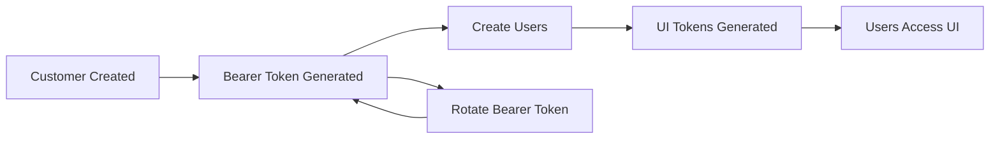

# Authentication

Invoice Collector supports two authentication methods: Bearer Token and UI Token.

## Bearer Token Authentication

Bearer tokens are used for API access and provide full access to the customer account.

### Getting a Bearer Token

Bearer tokens are generated during customer setup or can be regenerated:

```bash
curl -X POST http://localhost:8080/api/v1/customer/bearer \
  -H "Authorization: Bearer EXISTING_TOKEN" \
  -H "Content-Type: application/json"
```

Response:

```json
{
  "bearer": "new_bearer_token_here"
}
```

!!! danger "Security"
    Keep bearer tokens secure! They provide full access to your account.

### Using Bearer Tokens

Include the bearer token in the `Authorization` header:

```bash
curl -X GET http://localhost:8080/api/v1/users \
  -H "Authorization: Bearer YOUR_BEARER_TOKEN"
```

## UI Token Authentication

UI tokens are user-specific and provide limited access for UI purposes.

### Getting a UI Token

UI tokens are returned when creating a user:

```bash
curl -X POST http://localhost:8080/api/v1/user \
  -H "Authorization: Bearer YOUR_BEARER_TOKEN" \
  -H "Content-Type: application/json" \
  -d '{
    "remote_id": "user123",
    "locale": "en",
    "email": "user@example.com"
  }'
```

Response includes:

```json
{
  "user_id": "...",
  "token": "ui_token_here"
}
```

### Using UI Tokens

UI tokens are used in two ways:

**1. Query Parameter (Web UI)**

```
http://localhost:8080/api/v1/ui?token=UI_TOKEN
```

**2. Query Parameter (API)**

```bash
curl -X GET http://localhost:8080/api/v1/credentials?token=UI_TOKEN
```

## Authentication Scopes

### Bearer Token Scope

- ✅ Full customer management
- ✅ Create/delete users
- ✅ Manage all credentials
- ✅ Access all users' data
- ✅ Configure callbacks
- ✅ View statistics

### UI Token Scope

- ✅ View own credentials
- ✅ Add own credentials
- ✅ Delete own credentials
- ✅ Submit 2FA codes
- ✅ Trigger collection
- ❌ Manage other users
- ❌ Customer configuration

## Token Security

### Best Practices

1. **Store Securely** - Never commit tokens to version control
2. **Use Environment Variables** - Store tokens in environment variables
3. **Rotate Regularly** - Generate new bearer tokens periodically
4. **HTTPS Only** - Always use HTTPS in production
5. **Minimal Exposure** - Only share UI tokens with end users

### Token Storage

**Good:**

```bash
# Environment variable
export INVOICE_COLLECTOR_BEARER="your_token"

# .env file (not committed)
BEARER_TOKEN=your_token
```

**Bad:**

```javascript
// Hardcoded in code
const bearerToken = "sk_live_12345..."; // ❌ Never do this!
```

## Verification Codes

When `DISABLE_VERIFICATION_CODE` is false, users must verify their email before accessing the UI.

### Verification Flow

1. User receives an email with a verification code
2. User enters code when accessing UI
3. UI token is validated with verification code

```
http://localhost:8080/api/v1/ui?token=UI_TOKEN&verificationCode=CODE
```

## Error Responses

### 401 Unauthorized

```json
{
  "type": "error",
  "reason": "Unauthorized",
  "message": "Invalid or missing authentication token"
}
```

**Causes:**
- Missing `Authorization` header
- Invalid bearer token
- Expired token

### 403 Forbidden

```json
{
  "type": "error",
  "reason": "Forbidden",
  "message": "Insufficient permissions"
}
```

**Causes:**
- UI token used for bearer-only endpoints
- Accessing other users' resources

## Examples

### Bearer Token Example

```javascript
const axios = require('axios');

const api = axios.create({
  baseURL: 'http://localhost:8080/api/v1',
  headers: {
    'Authorization': `Bearer ${process.env.BEARER_TOKEN}`,
    'Content-Type': 'application/json'
  }
});

// Use the API
const users = await api.get('/users');
```

### UI Token Example

```javascript
const token = getUserToken(); // From user session

// Access UI
window.location.href = `http://localhost:8080/api/v1/ui?token=${token}`;

// Or make API calls
const response = await fetch(
  `http://localhost:8080/api/v1/credentials?token=${token}`
);
```

## Token Lifecycle



## Next Steps

- [Explore API endpoints](endpoints.md)
- [Set up webhooks](webhooks.md)
- [Quick start guide](../getting-started/quick-start.md)
