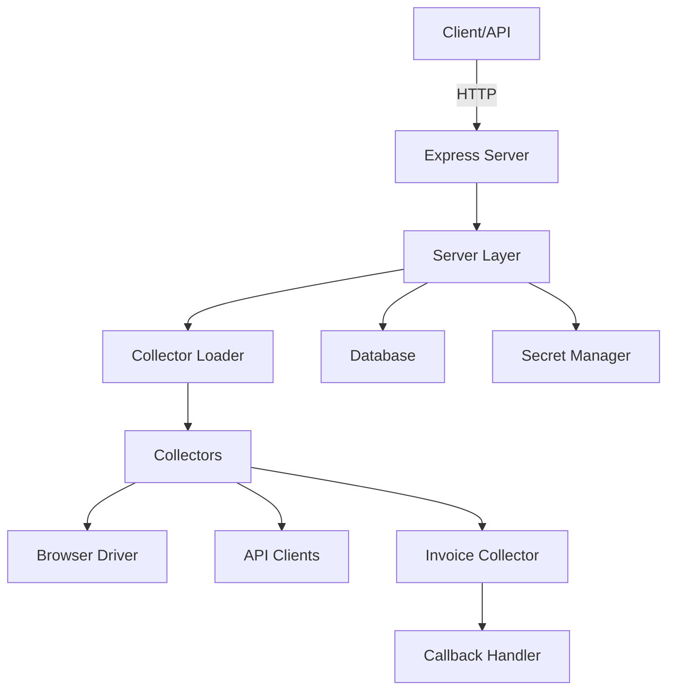
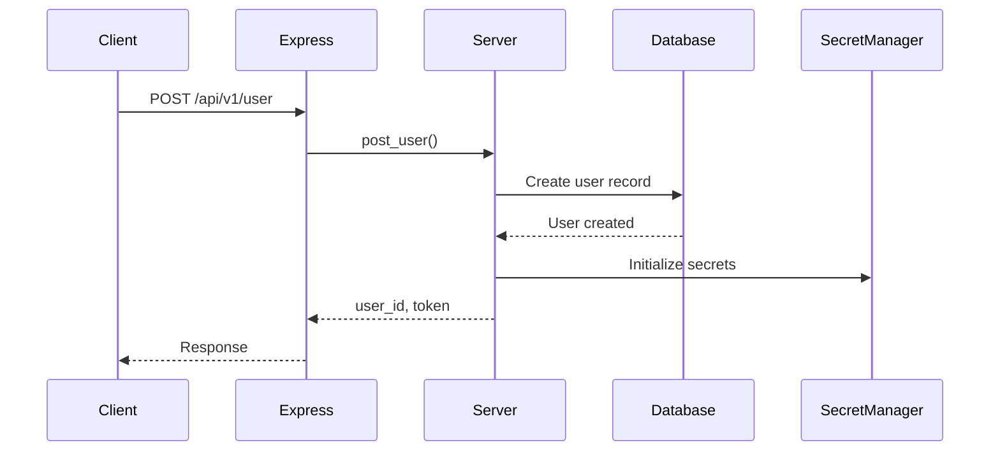
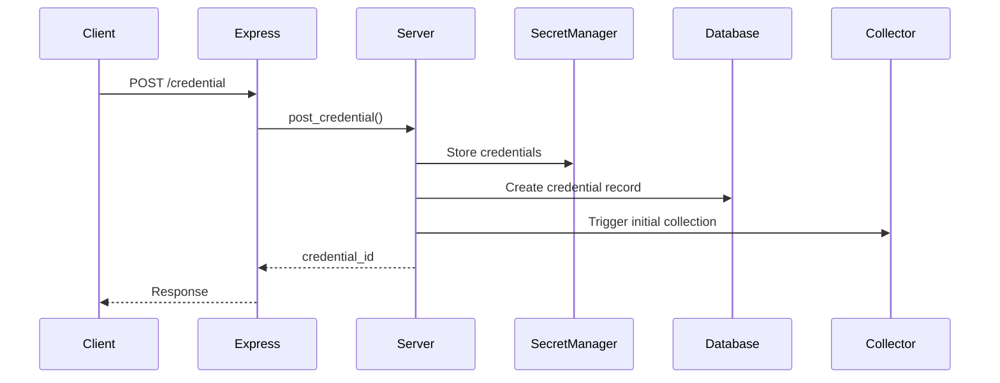
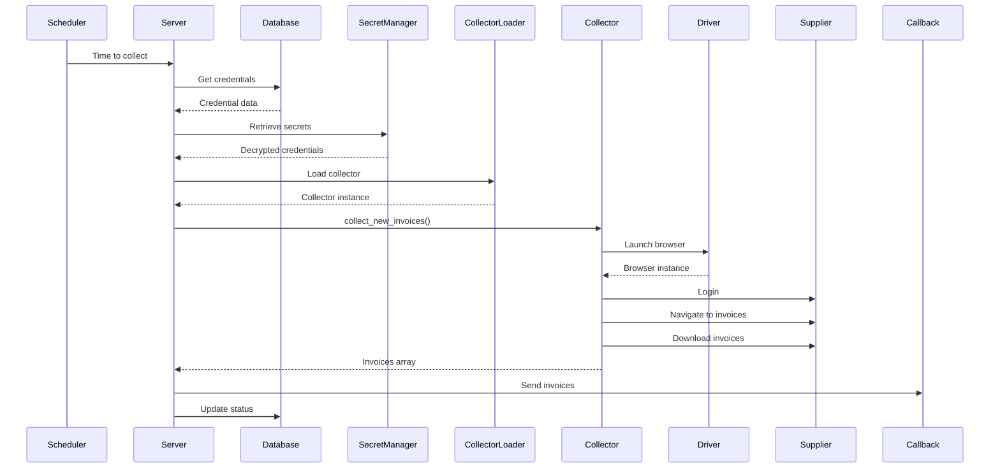
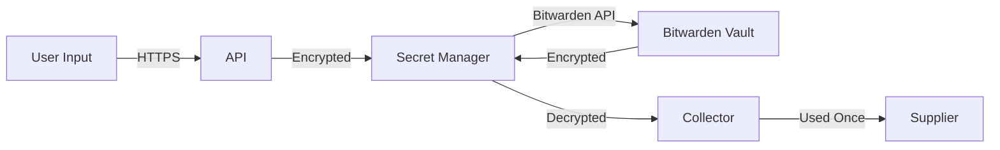

# Architecture

Understanding the Invoice Collector architecture.

## High-Level Overview



## Core Components

### 1. Express Server (`src/index.ts`)

- Entry point for the application
- Defines all REST API endpoints
- Handles authentication
- Routes requests to the Server layer

**Key responsibilities:**

- HTTP request handling
- Route definition
- Error handling
- Request validation

### 2. Server Layer (`src/server.ts`)

- Business logic layer
- Coordinates between components
- Manages users and credentials
- Triggers invoice collection

**Key responsibilities:**

- User management
- Credential management
- Collection orchestration
- Statistics and monitoring

### 3. Collector System

#### Collector Loader (`src/collectors/collectorLoader.ts`)

- Dynamically loads collectors
- Manages collector registry
- Provides collector metadata

#### Abstract Collector (`src/collectors/abstractCollector.ts`)

Base class for all collectors defining:

- Configuration schema
- Collection interface
- Common utilities

#### Collector Types

**Web Collectors** (`webCollector.ts`, `web2Collector.ts`)

- Use Puppeteer for browser automation
- Handle authentication flows
- Navigate and scrape invoices
- Support anti-bot evasion

**API Collectors** (`apiCollector.ts`)

- Direct API integration
- Token-based authentication
- REST/GraphQL communication

**Sketch Collectors** (`sketchCollector.ts`)

- Experimental collectors
- AI-assisted collection
- Prototype implementations

### 4. Browser Driver (`src/driver/`)

- Manages Puppeteer instances
- Handles browser lifecycle
- Implements anti-detection measures
- Manages proxies

**Features:**

- Headless/headed modes
- Custom user agents
- Cookie management
- Screenshot capture

### 5. Database Layer (`src/database/`)

- MongoDB abstraction
- User and credential storage
- Invoice metadata
- Collection history

**Collections:**

- `customers` - Customer accounts
- `users` - End users
- `credentials` - Stored credentials
- `invoices` - Invoice metadata
- `collections` - Collection history

### 6. Secret Manager (`src/secret_manager/`)

- Secure credential storage
- Bitwarden integration
- Encryption/decryption
- Secret rotation

### 7. Collection System (`src/collect/`)

- Collection queue management
- Scheduling logic
- 2FA handling
- Retry logic

### 8. Callback System (`src/callback/`)

- Webhook delivery
- Retry logic
- Error handling
- Event formatting

## Data Flow

### Creating a User



### Adding Credentials



### Collecting Invoices



## Collector Architecture

### Collector Hierarchy

```
AbstractCollector (Base)
├── WebCollector (Browser-based)
│   ├── Web2Collector (Enhanced)
│   └── V1Collector (Legacy)
├── APICollector (API-based)
└── SketchCollector (Experimental)
```

### Collector Lifecycle

1. **Initialization**
   - Load configuration
   - Validate parameters

2. **Authentication**
   - Launch browser/API client
   - Login with credentials
   - Handle 2FA if needed

3. **Navigation**
   - Navigate to invoice section
   - Apply date filters

4. **Collection**
   - List available invoices
   - Download each invoice
   - Extract metadata

5. **Cleanup**
   - Close browser
   - Return results

### Example Collector Structure

```typescript
export class AmazonCollector extends WebCollector {
  async collect_new_invoices(
    state: State,
    twofa_promise: TwofaPromise,
    secret: Secret,
    download_from_timestamp: number,
    previousInvoices: any[],
    location: Location | null
  ): Promise<CompleteInvoice[]> {
    // 1. Setup
    const page = await this.launch_browser(location);
    
    // 2. Login
    await this.login(page, secret);
    
    // 3. Handle 2FA
    if (await this.requires_2fa(page)) {
      const code = await twofa_promise.wait();
      await this.submit_2fa(page, code);
    }
    
    // 4. Navigate to invoices
    await page.goto('https://amazon.com/orders');
    
    // 5. Collect invoices
    const invoices = await this.scrape_invoices(
      page, 
      download_from_timestamp
    );
    
    // 6. Download PDFs
    for (const invoice of invoices) {
      invoice.data = await this.download_pdf(page, invoice.link);
    }
    
    // 7. Cleanup
    await page.close();
    
    return invoices;
  }
}
```

## Security Architecture

### Credential Flow



### Security Layers

1. **Transport Security** - HTTPS for all communication
2. **Authentication** - Bearer tokens and UI tokens
3. **Encryption** - Credentials encrypted in Bitwarden
4. **Isolation** - Each collection runs in isolation
5. **Secrets** - Never logged or stored in plain text

## Scalability

### Horizontal Scaling

- Stateless server design
- Multiple server instances possible
- Shared MongoDB database
- Load balancer recommended

### Collection Queue

- Background job processing
- Concurrent collection limits
- Priority queue for manual triggers
- Exponential backoff for retries

### Performance Optimizations

- Connection pooling for database
- Browser instance reuse
- Lazy loading of collectors
- Incremental collection (only new invoices)

## Monitoring

### Metrics

- Collection success rate
- Average collection time
- Active credentials
- Invoice count
- Error rates

### Logging

- Structured logging
- Collection events
- Error tracking
- Performance metrics

## Technology Stack

- **Runtime:** Node.js
- **Language:** TypeScript
- **Web Framework:** Express
- **Database:** MongoDB
- **Browser Automation:** Puppeteer
- **Secret Management:** Bitwarden
- **Testing:** Jest

## Next Steps

- [Creating collectors](creating-collectors.md)
- [Testing guide](testing.md)
- [Contributing](contributing.md)
