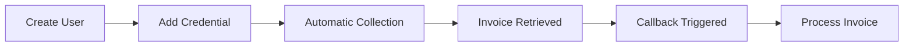

# User Guide Overview

Welcome to the Invoice Collector user guide! This section provides comprehensive information on how to use Invoice Collector effectively.

## What You'll Learn

In this guide, you'll learn how to:

- **Manage Collectors** - Understand different types of collectors and how to use them
- **Add and Manage Credentials** - Securely store and manage supplier credentials
- **Collect Invoices** - Automatically retrieve invoices from multiple suppliers
- **Access Invoices** - View and download collected invoices
- **Set Up Callbacks** - Configure webhooks to receive invoice notifications

## Core Concepts

### Users

Users represent individual people or entities that have invoices. Each user can have multiple credentials for different suppliers.

**Key features:**

- Unique identifier (`user_id`)
- Access token for UI access
- Multiple credentials per user
- Locale and email configuration

### Credentials

Credentials are the login information for accessing supplier portals. They are securely stored in Bitwarden.

**Key features:**

- Linked to a specific user
- Associated with a collector
- Secure storage with encryption
- Automatic collection scheduling

### Collectors

Collectors are modules that know how to connect to specific suppliers and retrieve invoices. Each collector is specialized for a particular supplier.

**Types of collectors:**

- **Web Collectors** - Use browser automation to log in and download invoices
- **API Collectors** - Connect directly to supplier APIs
- **Email Collectors** - Extract invoices from email inboxes
- **Sketch Collectors** - Experimental collectors in development

### Invoices

Invoices are the documents retrieved from suppliers. Each invoice includes:

- Unique identifier
- Timestamp (invoice date)
- Amount (when available)
- Document (PDF or other format)
- Metadata (supplier-specific information)

## Workflow

The typical workflow with Invoice Collector:



### 1. Create a User

First, create a user account. This can be done via the API or through your application.

```bash
POST /api/v1/user
```

### 2. Add Credentials

Add credentials for each supplier you want to collect invoices from.

```bash
POST /api/v1/user/{user_id}/credential
```

### 3. Automatic Collection

Invoice Collector automatically collects invoices based on:

- Initial collection when credential is added
- Scheduled collections (configurable)
- Manual triggers via API

### 4. Access Invoices

Retrieved invoices are:

- Sent to your callback URL (webhook)
- Accessible via the UI
- Stored in the database

### 5. Process Invoices

In your application, process the invoices as needed:

- Store in your accounting system
- Extract data for analysis
- Archive for compliance

## Collection Frequency

Invoice Collector uses smart scheduling to collect invoices efficiently:

- **Initial Collection**: When a credential is first added
- **Regular Checks**: Periodic checks for new invoices
- **Manual Trigger**: On-demand collection via API

!!! info "Automatic Scheduling"
    The collection frequency is optimized per collector to balance freshness with resource usage.

## Status States

Credentials and collection jobs go through various states:

| State | Description | Actions |
|-------|-------------|---------|
| `pending` | Waiting to start collection | Wait |
| `collecting` | Currently collecting invoices | Monitor progress |
| `2fa_required` | Two-factor auth code needed | Provide 2FA code |
| `success` | Collection completed | Review invoices |
| `error` | An error occurred | Check error details |

## Best Practices

### Security

1. **Use Strong Passwords** - Ensure supplier credentials are strong
2. **Enable 2FA** - Use two-factor authentication when available
3. **Regular Review** - Periodically review credentials and access
4. **Secure Callbacks** - Use HTTPS for callback URLs

### Performance

1. **Reasonable Timestamps** - Don't collect all historical invoices unless needed
2. **Monitor Errors** - Check credential status regularly
3. **Update Credentials** - Keep credentials up to date when passwords change

### Organization

1. **Descriptive IDs** - Use meaningful `remote_id` values
2. **Consistent Locale** - Use the same locale for all users in your organization
3. **Callback Handling** - Implement robust callback processing

## UI vs API

Invoice Collector offers two ways to interact with it:

### Web UI

**Best for:**

- Individual users
- Manual credential management
- Quick setup and testing
- Visual feedback

**Access:**

```
http://localhost:8080/api/v1/ui?token=USER_TOKEN
```

### REST API

**Best for:**

- Integration with existing systems
- Automated workflows
- Bulk operations
- Custom user interfaces

**Documentation:**

See the [API Reference](../api/overview.md) for details.

## Localization

Invoice Collector supports multiple languages:

- English (en)
- French (fr)
- Additional languages can be added

Set the locale when creating a user or via the UI.

## Next Steps

- [Learn about available collectors](collectors.md)
- [Manage credentials effectively](credentials.md)
- [Work with invoices](invoices.md)
- [Set up API integration](../api/overview.md)

## Getting Help

- 💬 [Discord Community](https://discord.gg/dMXTdpxMqY) - Ask questions and share experiences
- 🐛 [GitHub Issues](https://github.com/invoice-collector/invoice-collector/issues) - Report bugs
- 📚 [API Documentation](../api/overview.md) - Technical reference
- 🌐 [Website](https://invoice-collector.com) - Official website
